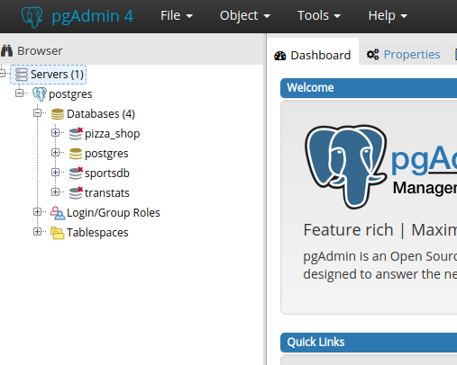
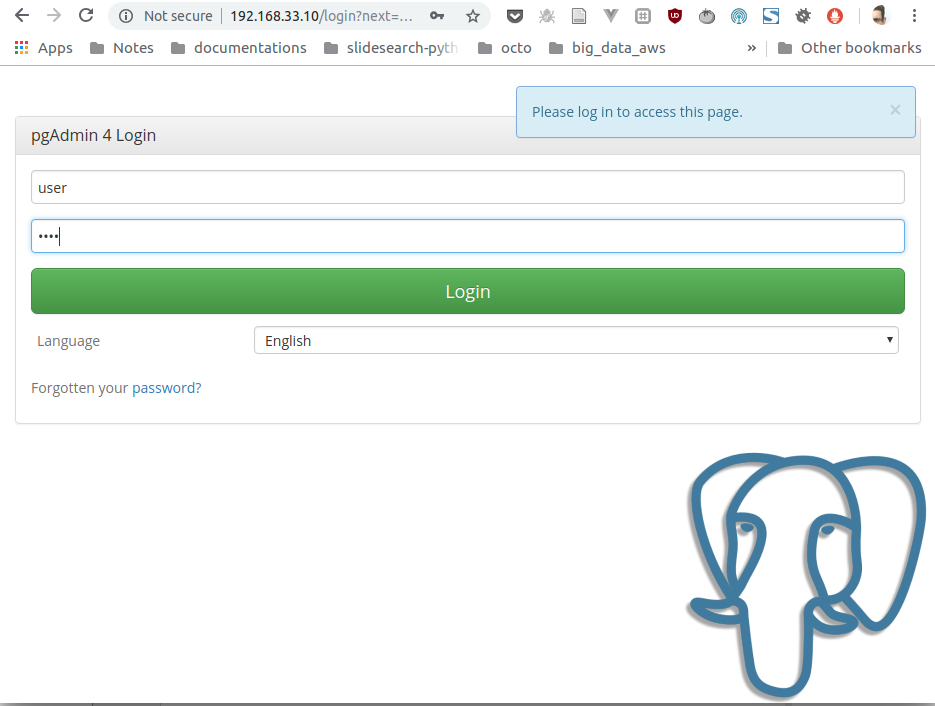
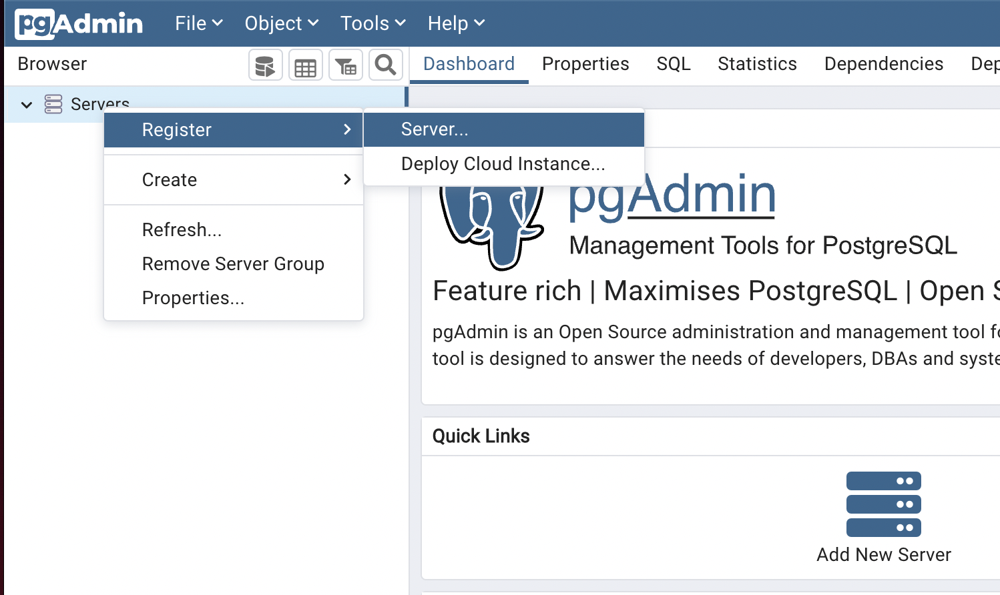
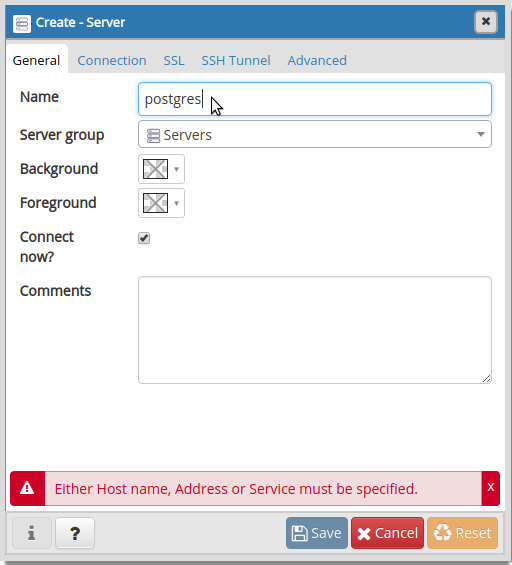
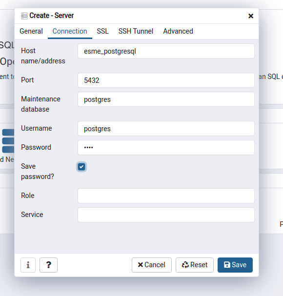

This repository contains scripts to create a virtual machine that exposes databases we use
during classes:

* bio_icare_drone
* pizza_shop
* sportsdb
* transtats



General information
===================

* [website](esme.farcellier.com)

Requirement 1 : installation to perform on your computer
========================================================

You will need those softwares on your computer :

* [Docker](https://www.docker.com/)
* [Git](https://git-scm.com/)

On linux
---------

* 1. [install docker](https://docs.docker.com/engine/install/ubuntu/)

* 2. install git

```
sudo apt-get install git
```

* 3. [install docker-compose](https://docs.docker.com/compose/install/#install-compose-on-linux-systems)

On windows
-----------

* 1. [install docker](https://docs.docker.com/docker-for-windows/install/)

* 2. [install git](https://git-scm.com/download/win)

On mac
-------

* 1. [install docker](https://docs.docker.com/docker-for-mac/install/)

* 2. install git

```
brew install git
```


Step 1 : install the environment
================================

1. clone this repository :

```
git clone https://github.com/Esme-Sudria-Database/lab-postgresql.git
```

2. go on directory

```bash
cd lab-postgresql
```

3. mount the lab

```bash
docker-compose up
```

Step 2 : configure pgadmin to use postgresql database
=====================================================

1. connect on ``http://localhost:8080`` with your browser



Here is the logging information to use :

* Utilisateur : admin@admin.fr
* Password : admin

2. declare your postgresql database in pgadmin



2.1. write the display name in pgadmin



2.2. configure the server connection



* Host Name : esme_postgresql
* login : postgres
* password: 1234

Magic behind the hostname : the Host Name is resolved through [user-defined-network on docker](https://docs.docker.com/v17.09/engine/userguide/networking/configure-dns/).

Step 3: use the database that match our practical work
======================================================

Architecture
============

[To complete]

Troubleshooting
===============

[To complete]

Run continuous integration process
==================================

    make tests
